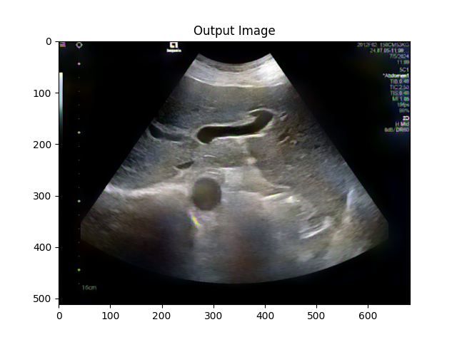

# Neural Transfer
---
基于Neural Transfer方法实现医学图像风格迁移。

文章链接 [Gatys_Image_Style_Transfer_CVPR_2016_paper](https://www.cv-foundation.org/openaccess/content_cvpr_2016/papers/Gatys_Image_Style_Transfer_CVPR_2016_paper.pdf)。

代码来源 [Pytorch](https://pytorch.org/tutorials/advanced/neural_style_tutorial.html)

---
样例展示：

内容图像：

风格图像：

生成结果：
